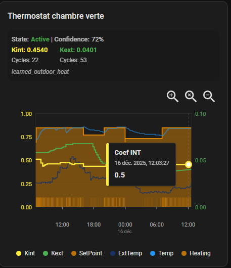

# Versatile Thermostat Auto-TPI Learning Card

[](https://github.com/hacs/integration)

Lovelace Home-assistant card for **Versatile Thermostat** AUTO-TPI feature.

The main goal of this card is to display historical data of an Auto TPI learning session. It allows you to visualize the convergence of the coefficients (Kint and Kext) and analyze their correlation with internal/external temperatures and heating cycles.



## Requirements

*   [Versatile Thermostat](https://github.com/jmcollin78/versatile_thermostat) integration installed.
*   A thermostat entity configured with **Auto-TPI** enabled.

## Installation

### HACS (Recommended)

This card is available in HACS (Home Assistant Community Store).

1.  Click the button below to add this repository to HACS:

    [](https://my.home-assistant.io/redirect/hacs_repository/?owner=jmcollin78&repository=auto-tpi-learning-card&category=plugin)

2.  **Or** manually add this repository URL to HACS:
    *   Go to **HACS** > **Frontend**.
    *   Click the 3 dots in the top right corner > **Custom repositories**.
    *   URL: `https://github.com/jmcollin78/auto-tpi-learning-card`
    *   Category: **Lovelace**
    *   Click **Add**.

3.  Search for **Auto TPI Learning** and click **Download**.

4.  Reload your resources if prompted.

### Manual Installation

1.  Download the `auto-tpi-learning-card.js` file from the [Releases](https://github.com/jmcollin78/auto-tpi-learning-card/releases) page or the `dist` folder.
2.  Copy the file to your Home Assistant `config/www/community/auto-tpi-learning-card/` directory.
3.  Add the resource to your Dashboard:
    *   Go to **Settings** > **Dashboards** > **Three dots** (top right) > **Resources**.
    *   Click **Add Resource**.
    *   URL: `/local/community/auto-tpi-learning-card/auto-tpi-learning-card.js`
    *   Resource Type: **JavaScript Module**.

## Configuration

You can configure the card using the visual editor or via YAML.

### Visual Editor

1.  Edit your dashboard.
2.  Click **Add Card**.
3.  Search for and select **Auto-TPI Learning Card**.
4.  **Name**: (Optional) specific title for the card.
5.  **Climate Entity**: Select your Versatile Thermostat entity.
6.  **Learning Entity**: Select the associated learning state sensor (e.g., `sensor.thermostat_auto_tpi_learning_state`). The editor will attempt to auto-detect this based on the climate entity.


### YAML Configuration

```yaml
type: custom:auto-tpi-learning-card
name: Salon Learning Session
climate_entity: climate.salon
learning_entity: sensor.salon_auto_tpi_learning_state
```

| Option | Type | Required | Description |
| --- | --- | --- | --- |
| `type` | string | **Yes** | `custom:auto-tpi-learning-card` |
| `climate_entity` | string | **Yes** | The VTherm climate entity. |
| `learning_entity` | string | **Yes** | The sensor entity tracking the learning state. |
| `name` | string | No | Custom title for the card. |

## Features

*   **Interactive Chart**:
    *   **Zoom**: Use the mouse wheel or pinch gesture to zoom in/out.
    *   **Pan**: Drag the chart left/right to move through time.
*   **Data Series**:
    *   **Kint**: Calculated Internal Coefficient.
    *   **Kext**: Calculated External Coefficient.
    *   **Temp**: Current room temperature.
    *   **ExtTemp**: External temperature.
    *   **SetPoint**: Target temperature.
    *   **Heating**: Orange bars indicating when the heating was active.
*   **Legend**: Click on legend items to toggle the visibility of specific series.
*   **Tooltip**: Hover over the chart to see precise values for specific timestamps.

## Build

To build the card from source:

1.  Install dependencies:
    ```bash
    npm install
    ```

2.  Build the project:
    ```bash
    npm run build